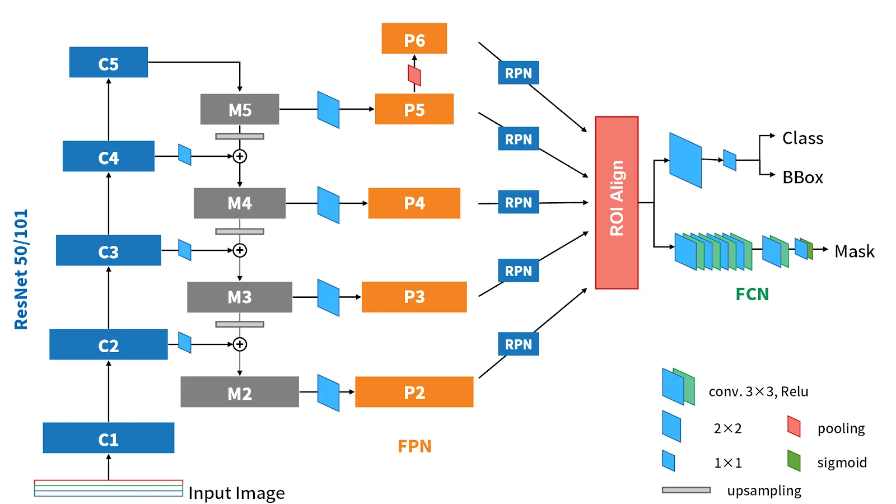

没问题！既然你觉得之前的讲解"骨架"有了但"血肉"不够丰满，那我们就深入到底。
我将保持之前的结构，但把每一个模块的**计算细节、维度变化、设计背后的逻辑**全部拆开揉碎了讲。特别是针对你关注的**Mamba/序列建模**背景，我会特别点出哪些设计思想是可以互通的。
---
# 🚀 Mask R-CNN：深度拆解版（面向算法设计者）
**核心定位再确认**：
Mask R-CNN不仅仅是一个分割网络，它是一个**"先定位，后分割"的两阶段框架**。
- **Stage 1 (RPN)**：解决"Where"的问题（感兴趣区域在哪？）
- **Stage 2 (Head)**：解决"What"和"Which Pixel"的问题（是什么？像素级轮廓是啥？）
---
## 第一步：整体架构鸟瞰（数据流与维度追踪）
我们不仅仅看框图，我们要看**张量**是如何流动的。
假设输入图像尺寸为 $H \times W \times 3$（例如 $800 \times 800 \times 3$）。
```
┌───────────────────────────────────────────────────────────────────────────┐
│                           Mask R-CNN 详细数据流                            │
│                                                                           │
│  1. 输入预处理                                                             │
│     Image (800, 800, 3)                                                   │
│         ↓ (减均值、归一化)                                                 │
│                                                                           │
│  2. Backbone (ResNet50)                                                   │
│     Image → C2 (200, 200, 256)  ← 1/4下采样                               │
│           → C3 (100, 100, 512)  ← 1/8下采样                               │
│           → C4 (50, 50, 1024)   ← 1/16下采样                              │
│           → C5 (25, 25, 2048)   ← 1/32下采样                              │
│                                                                           │
│  3. Neck (FPN)                                                            │
│     自顶向下融合，输出 P2-P5 四个特征层，通道数统一为 256                    │
│     P5 (25, 25, 256)                                                      │
│     P4 (50, 50, 256)                                                      │
│     P3 (100, 100, 256)                                                    │
│     P2 (200, 200, 256)                                                    │
│                                                                           │
│  4. RPN (区域提议网络)                                                     │
│     在 P2-P5 上滑窗，生成约 2000 个候选框                       │
│     每个框包含：坐标 + 置信度                                              │
│                                                                           │
│  5. ROI Align (特征对齐)                                                  │
│     每个 Proposal 从特征图上抠出，缩放为固定尺寸                            │
│     → Box Head输入: (7, 7, 256)                                           │
│     → Mask Head输入: (14, 14, 256)  ← 注意：分辨率更高                     │
│                                                                           │
│  6. Heads (任务头)                                                        │
│     ┌─ Box Head ─→ 全连接层 ─→ (类别概率, 边框回归值)                       │
│     │                                                                     │
│     └─ Mask Head ─→ FCN网络 ─→ (28, 28, K) 二值掩码 (K为类别数)            │
└───────────────────────────────────────────────────────────────────────────┘
```
---
## 第二步：逐模块深度拆解
### 模块1：Backbone + FPN（特征提取与融合）
#### 1.1 Backbone (ResNet)
你已经懂CNN，这里只强调一点：**为什么需要多层特征？**
```
浅层特征 (C2, C3)：
├── 优点：分辨率高，几何细节丰富（边缘、纹理）
├── 缺点：感受野小，语义信息弱（不知道"这是什么"）
└── 对你的价值：适合做 Deformable Token 的初始采样点
深层特征 (C4, C5)：
├── 优点：感受野大，语义信息强（知道"这是飞机"）
├── 缺点：分辨率低，空间细节丢失（不知道"机翼边缘在哪"）
└── 对你的价值：适合做 Global Token，指导浅层特征
```
#### 1.2 FPN (Feature Pyramid Network) —— "优雅的融合"
FPN的精髓在于**把深层的语义"传导"给浅层**。
**详细计算过程：**
```python
# 伪代码演示 FPN 融合过程
# C5, C4, C3, C2 是 Backbone 输出，通道数不同 (2048, 1024, 512, 256)
# 1. 最深层直接通过 1x1 卷积调整通道
P5 = Conv1x1(C5)  # (25, 25, 256)
# 2. 自顶向下融合
# P5 上采样 -> 与 C4 融合 -> P4
P5_up = Upsample(P5, scale_factor=2)  # (50, 50, 256)
C4_proj = Conv1x1(C4)                 # (50, 50, 256)
P4 = P5_up + C4_proj                  # 逐元素相加
# P4 上采样 -> 与 C3 融合 -> P3
P4_up = Upsample(P4, scale_factor=2)  # (100, 100, 256)
C3_proj = Conv1x1(C3)                 # (100, 100, 256)
P3 = P4_up + C3_proj
# P3 上采样 -> 与 C2 融合 -> P2
# ...以此类推
```
**FPN 与你的 "SASAM" 创新点对比：**
- **FPN**：简单的 `Add` 融合。
- **你的 SASAM**：引入了**注意力机制**。这比简单的 `Add` 更聪明，它能让网络自己学习"哪部分深层特征更重要，哪部分浅层特征该保留"。这是你论文的一个重要卖点。
---
### 模块2：RPN（区域提议网络）—— "滑窗式扫描仪"
RPN 是一个**全卷积网络**，它滑动在 FPN 输出的每一层特征图上。
#### 2.1 锚框机制 —— "预设的参考框"
这是目标检测中极其重要的概念。
```
假设在 P3 层 (Stride=8)：
├── 图像上一个像素点，对应原图 8x8 的区域
├── 在这个点上，生成 3 种尺度 x 3 种比例 = 9 个锚框
│   ├── 尺度: 32, 64, 128 (对应原图大小)
│   └── 比例: 1:1, 1:2, 2:1
└── 如果 P3 大小为 100x100，则生成 100x100x9 = 90,000 个锚框！
```
**RPN 的工作流程：**
```
输入: P3 特征图 (100, 100, 256)
      ↓
3x3 卷积 (滑动窗口，每个位置整合周围特征)
      ↓
┌─────────────────────────────────────┐
│ 分支 1: 1x1 Conv (Objectness)       │
│   输出: (100, 100, 9) - 每个锚框是前景/背景的概率 │
├─────────────────────────────────────┤
│ 分支 2: 1x1 Conv (Regression)       │
│   输出: (100, 100, 36) - 每个锚框 4个偏移量 │
└─────────────────────────────────────┘
```
#### 2.2 损失函数与筛选
RPN 的损失函数：
$$L_{RPN} = L_{cls}(p_i, p_i^*) + \lambda p_i^* L_{reg}(t_i, t_i^*)$$
- $p_i$：预测是前景的概率。
- $p_i^*$：真实标签（1=前景，0=背景）。
- $t_i$：预测的偏移量。
- $t_i^*$：真实的偏移量（锚框到真实框的转换）。
**筛选过程：**
1. **排序**：根据 $p_i$ 排序，取前 12000 个锚框。
2. **NMS (非极大值抑制)**：把重叠度(IoU)过高的框删掉，保留最好的。
3. **取前 N 个**：最终保留约 1000-2000 个 Proposals。
**与你工作的关联：**
RPN 生成的 Proposals 是**粗糙的**。你的 **Deformable Token** 可以在后续处理中，根据这些 Proposals 动态调整关注区域，从而获得比固定 Proposal 更精细的特征。
---
### 模块3：ROI Align —— "像素级精度的关键"
这是 Mask R-CNN 的**灵魂改进**。一定要理解透彻。
#### 3.1 为什么 ROI Pooling 不行？
**举例说明：**
```
假设：
├── 输入图像: 800x800
├── 特征图 (P3): 100x100 (下采样倍数 Stride=8)
├── 候选框 坐标: (665, 665) 到 (715, 715)
```
**ROI Pooling 的做法（有缺陷）：**
1. **坐标取整**：$665 / 8 = 83.125 \rightarrow 83$。坐标量化误差产生了！
   - 真实框起点在 665，映射到特征图上却变成了 $83 \times 8 = 664$。
   - **差了 1 个像素**，对于小目标可能就是致命的。
2. **Pooling 归一化**：框的大小映射后可能是 $4.3 \times 4.3$，要强行分成 $7 \times 7$ 格子做 Max Pooling，又要取整。
#### 3.2 ROI Align 的做法（完美解决）
**核心思想：双线性插值**
```
步骤：
1. 不对坐标取整！保持浮点数 (83.125, 83.125)。
2. 假设要 Pooling 成 7x7，就把这个浮点区域划分成 7x7 个 Bin。
3. 每个 Bin 内部（比如 2x2 个采样点），利用周围的整数坐标像素进行插值计算。
```
**直观理解图示：**
```
特征图上的点:
. . . . .
. . x . .   (x 是整数坐标的特征点)
. . . . .
我们要采样点 (红点 *), 它坐标是 (3.6, 4.2):
    * 位于 (3,4) 和 (4,4) 之间...
ROI Align:
根据周围四个整数点 (3,4), (4,4), (3,5), (4,5) 的特征值，
通过距离加权 (双线性插值) 计算出 * 点的特征值。
```
**这对你意味着什么？**
这种**"不量化、精确采样"**的思想，和你的 **Deformable Token** 理念完全一致！
- **ROI Align**：在固定的网格上进行精确采样。
- **Deformable Token**：在**不固定**的位置（学习出的偏移量）上进行精确采样。
你可以把 ROI Align 看作是 Deformable 操作的一种特例（偏移量为 0）。
---
### 模块4：Box Head + Mask Head（并行多任务）
ROI Align 输出固定大小的特征图后，分道扬镳。
#### 4.1 Box Head (检测头)
```
输入: (7, 7, 256)
      ↓
Flatten: 7 * 7 * 256 = 12544 维向量
      ↓
FC Layer 1 (1024)
FC Layer 2 (1024)  ← 全连接层，参数量大，计算重
      ↓
┌──────────────────────────────────┐
│ 分类分支: FC (K+1)               │ K=类别数, +1=背景
│ 回归分支: FC (4K)                │ 每类 4 个坐标偏移
└──────────────────────────────────┘
```
#### 4.2 Mask Head (分割头) —— 全卷积设计
**为什么 Mask Head 不用全连接层？**
- 全连接层会破坏空间结构（变成一维向量）。
- 分割需要保留空间信息，所以必须用 **FCN (全卷积网络)**。
```
输入: (14, 14, 256)  ← 比 Box Head 输入大，为了保留更多细节
      ↓
Conv 3x3, 256
Conv 3x3, 256
Conv 3x3, 256
Conv 3x3, 256
      ↓
Deconv (反卷积) 2x2, stride 2  ← 上采样，分辨率翻倍
      ↓
输出: (28, 28, K)  ← K 个类别的二值掩码
      ↓
Sigmoid 激活
```
#### 4.3 "解耦" 的深层逻辑
这是 Mask R-CNN 最精妙的设计之一。
**如果不解耦：**
```
输出 (28, 28, K)，用 Softmax。
→ 类别之间竞争。
→ 假如有一架飞机停在舰船上，Softmax 会强制一个像素点"要么是飞机，要么是舰船"。
→ 边界处会变得模糊，因为类别概率打架。
```
**解耦设计：**
```
Box Head 说："这是第 5 类 (飞机)"。
Mask Head 输出 K 个通道，只看第 5 个通道。
第 5 个通道只负责二分类：这个像素是不是飞机？
→ 不受其他类别干扰。
→ 边界极其清晰。
```
---
## 第三步：Loss 函数与训练细节
**总 Loss 公式：**
$$L = L_{cls} + L_{box} + L_{mask}$$
**重点看 $L_{mask}$：**
- **输入**：Mask Head 输出的 $m \in (28, 28, K)$。
- **GT**：真实框对应的 $28 \times 28$ 二值掩码。
- **计算**：
  ```python
  # 假设 Box Head 预测类别为 k (第k类)
  # 只取第 k 个通道的特征图
  pred_mask_k = output[:, k, :, :]  # (28, 28)
  
  # 计算 Binary Cross Entropy
  loss = BCELoss(pred_mask_k, gt_mask)
  ```
- **意义**：**只惩罚正确的类别**。这避免了网络在训练时混乱——不知道该优化哪个通道。
---
## 第四步：你的创新点插入位置（升级版）
现在我们用更专业的视角重新审视你的改造计划：
| Mask R-CNN 模块 | 原始设计 | 你的改造 | 改造的核心逻辑 |
| :--- | :--- | :--- | :--- |
| **Backbone** | ResNet (CNN) | **VMamba (SSM)** | 将 2D 卷积特征提取替换为 **序列建模**。利用 Mamba 的线性复杂度处理高分辨率特征，解决 ResNet 感受野与计算量的矛盾。 |
| **Token 生成** | 无 (CNN像素级) | **Deformable Token** | **插入点在 VMamba Block 内部**。替代标准的 Patch Split，让 Token 序列适应目标形状，减少冗余计算。 |
| **特征融合** | FPN (Add) | **SASAM** | **插入点在 FPN 融合处**。引入空间注意力，让深层特征有选择地增强浅层特征，优于简单的像素相加。 |
| **特征对齐** | ROI Align | **保留** | ROI Align 本身已经很优秀。你的 Deformable Token 在 Backbone 阶段已经做了特征增强，这里无需大改。 |
| **训练监督** | GT Box/Mask | **SAM 蒸馏** | 在 Loss 层面增加蒸馏项。用 SAM 生成的伪标签或特征图作为额外的 "软标签" 监督 Mask Head。 |
**总结：**
Mask R-CNN 提供了一个**标准化、模块化**的骨架。
你的任务不是推翻它，而是**用更先进的组件（Mamba）替换老组件，并用更强的监督信号（SAM）驱动它学习**。
---
现在，这副骨架已经足够清晰。下一步，就是动手去"填肉"——跑通代码，验证想法。你准备好开始环境搭建了吗？





# 重点： RPN 与 ROI Align
没问题，这两个模块是Mask R-CNN乃至所有两阶段目标检测算法的**核心引擎**。RPN解决了"在哪里"的问题，ROI Align解决了"怎么精确提取"的问题。
我们深入到底，把原理、结构、计算过程全部拆开讲。
---
## 🔎 模块一：RPN (Region Proposal Network) —— "区域提议网络"
### 1. 核心原理：它是做什么的？
**一句话定位**：RPN是一个**全卷积网络**，它的任务是扫描整张特征图，告诉系统"哪些位置可能有目标"，并给出一个初步的方框。
**为什么需要它？**
在RPN出现之前，找目标是用传统方法（如选择性搜索），慢且无法通过反向传播学习。RPN的伟大之处在于：**它把"找框"这个任务变成了一个可微分的神经网络层**，可以和整个网络一起端到端训练。
### 2. 核心机制：锚框 —— "预设的参考系"
这是理解RPN的关键。RPN不会凭空画出框，它是基于**锚框**进行调整的。
#### 什么是锚框？
就是在特征图的**每一个空间位置**，预先铺设好若干个**不同尺度**和**不同长宽比**的固定框。
```
假设特征图某一点 (x, y)：
├── 锚框1: 128x128 像素 (正方形)
├── 锚框2: 256x128 像素 (宽扁形)
├── 锚框3: 64x128 像素 (瘦高形)
└── ... (通常设为 3种尺度 × 3种比例 = 9个锚框/位置)
关键理解：
这些锚框的中心点都对应原图的同一个位置。
它们覆盖了该位置可能出现的各种形状的目标。
```
#### RPN如何利用锚框？
RPN预测的不是"框的坐标"，而是**"锚框与真实目标框(GT)之间的差距"**。
```
预测值 = 锚框 + 预测偏移量
例如：
锚框中心: (100, 100), 宽高: (50, 50)
预测偏移: 中心向右移2像素, 宽度变大1.1倍
→ 最终框: (102, 100), (55, 55)
```
### 3. 网络结构设计
RPN的结构非常简洁，是一个典型的**滑窗检测器**。
```
输入：FPN输出的特征图 (例如 P3: H×W×256)
      ↓
┌─────────────────────────────────────┐
│ 核心层：3×3 卷积 (滑动窗口)          │  ← 关键！
│ 作用：整合每个点周围 3×3 邻域的信息   │
│ 输出：H×W×256 (特征更鲁棒)           │
└─────────────────────────────────────┘
      ↓
      ├──────────────────┬───────────────────┐
      │                  │                   │
┌─────▼──────┐    ┌──────▼──────┐     ┌──────▼──────┐
│ 分支1: 分类  │    │ 分支2: 回归  │     │ (分支3: 特征)│
│ (Obj Score) │    │ (Bbox Reg)  │     │  (有的变体有)│
└─────┬──────┘    └──────┬──────┘     └─────────────┘
      │                  │
  1×1 Conv            1×1 Conv
      │                  │
┌─────▼──────┐    ┌──────▼──────┐
│ 输出: H×W×(2k) │    │ 输出: H×W×(4k) │
│ (k=锚框数)    │    │ (k=锚框数)     │
│ Softmax/Sig  │    │ 线性回归       │
└─────────────┘    └─────────────┘
```
#### 详细解读输出维度：
假设每个位置有 $k=9$ 个锚框：
1.  **分类分支**：输出 $H \times W \times (2k)$。
    - 为什么是 $2k$？因为这是二分类（前景/背景），每个锚框输出2个分数。
    - 经过 Softmax 后，得到每个锚框"是目标"的概率。
2.  **回归分支**：输出 $H \times W \times (4k)$。
    - 每个锚框需要预测4个偏移量 $(dx, dy, dw, dh)$。
    - $dx, dy$：中心点平移。
    - $dw, dh$：宽高缩放。
### 4. 训练时的正负样本匹配
这是RPN训练的精髓。网络怎么知道该预测什么？
```
对于生成的成千上万个锚框，我们需要给它打标签：
├── 正样本：
│   1. 与某个真实框 的 IoU (交并比) > 0.7
│   2. 或者与某个 GT 的 IoU 是最高的 (防止漏标)
│
├── 负样本：
│   1. 与所有 GT 的 IoU 都 < 0.3
│
└── 忽略：
    1. IoU 在 0.3 ~ 0.7 之间的 (模棱两可，不参与训练)
```
### 5. 输出后处理：NMS
RPN输出的是几万个框，直接用会爆炸。需要精简：
1.  **排序**：根据分类分数（前景概率）排序。
2.  **NMS (非极大值抑制)**：
    - 如果两个框重叠度很高，说明他们在找同一个目标。
    - 保留分数高的，删掉分数低的。
3.  **取Top N**：通常保留前 2000 个框，送入下一阶段。
---
## 🧩 模块二：ROI Align —— "感兴趣区域对齐"
### 1. 核心原理：它解决了什么痛点？
**痛点**：特征图与原图的坐标映射存在**量化误差**。
**举例说明**：
```
场景：
├── 原图大小：800×800
├── 特征图大小 (Stride=16)：50×50
├── RPN给出的候选框坐标：(665, 665) 到 (715, 715)
问题：如何把这个框映射到 50×50 的特征图上？
```
#### 传统的 ROI Pooling 做法法（有缺陷）：
$$坐标计算 = 原图坐标 / 步长$$
$$665 / 16 = 41.5625$$
ROI Pooling 会**强行取整** $\rightarrow 41$。
**结果**：框的左上角从原图的665变成了 $41 \times 16 = 656$。
**误差**：$665 - 656 = 9$ 个像素！
对于大目标，9像素无所谓；但对于小目标（比如30像素宽的飞机），这就意味着目标的**三分之一**都偏出去了！做分割时，边缘根本对不上。
### 2. ROI Align 的解决方案：双线性插值
**核心思想**：坐标不取整，保留浮点数，用插值计算小数点的特征值。
### 3. 详细计算流程 (Step-by-Step)
假设我们需要把一个任意大小的候选框特征，统一成 $7 \times 7$ 的固定大小。
#### Step 1: 保持浮点坐标
- 不对候选框坐标做取整。假设映射到特征图上的框是 $(x_{min}, y_{min}, x_{max}, y_{max})$，这些值都是浮点数（如 $41.56$）。
#### Step 2: 划分网格
- 把这个浮点框划分为 $7 \times 7$ 个格子。
- 计算每个格子的宽高：
  $$Bin\_Width = (x_{max} - x_{min}) / 7$$
  $$Bin\_Height = (y_{max} - y_{min}) / 7$$
#### Step 3: 采样点插值 —— **最关键的一步**
- 在每个格子内部，通常选取 **4个采样点**（比如均匀分布）。
- 这4个点的坐标肯定是浮点数（例如 $(41.7, 42.3)$）。
- 特征图上只有整数坐标有值（如 $(41, 42)$）。
- **双线性插值公式**：
  利用该点周围最近的4个整数坐标点的特征值，根据距离加权求和。
```
示意：
    (x1, y1) ---- (x2, y1)
        |    * (待求点)
        |
    (x1, y2) ---- (x2, y2)
值 = (x2-x)*(y2-y)*V(x1,y1) + (x-x1)*(y2-y)*V(x2,y1) + ...
```
通过这一步，我们算出了浮点坐标处的精确特征。
#### Step 4: 池化
- 对每个格子内的4个插值结果，取最大值或平均值。
- 最终输出一个 $7 \times 7 \times Channels$ 的特征图。
### 4. 对比总结
| 特性 | ROI Pooling (旧) | ROI Align (新) |
| :--- | :--- | :--- |
| **坐标处理** | 量化取整 (如 41.56 → 41) | **保留浮点数 (41.56)** |
| **特征采样** | 直接取整数坐标的值 | **双线性插值** |
| **对齐精度** | 有像素偏移，小目标误差大 | **像素级精确对齐** |
| **适用任务** | 目标检测 (框一级别) | **实例分割 (像素一级别)** |
"。

---
---

你的理解有一半是对的，但在 **"ROI Align 如何利用多层特征"** 这一点上有关键误区。
让我分三步把这个问题彻底讲清楚，这涉及到 FPN（特征金字塔）的核心设计。
---
### 第一步：RPN 在每一层特征图上都运行吗？
**答案是：是的。**
在 Mask R-CNN (带FPN) 中，RPN 是**共享权重**的，它在 P2, P3, P4, P5 每一层特征图上都进行一次滑动扫描。
**为什么这么做？**
为了解决**多尺度目标检测**的问题。
*   **P2 (分辨率高)**：负责检测小目标（因为它保留了更多细节）。
*   **P5 (分辨率低)**：负责检测大目标（因为它感受野大，语义强）。
**流程：**
```
P2 特征图 → RPN Head → 生成一批候选框
P3 特征图 → RPN Head → 生成一批候选框
P4 特征图 → RPN Head → 生成一批候选框
P5 特征图 → RPN Head → 生成一批候选框
```
*注：这里的 RPN Head 是同一个网络（共享权重），只是输入的特征图层级不同。*
---
### 第二步：筛选是怎么做的？
**答案是：所有层生成的框混在一起筛选。**
每一层 RPN 都会生成几千个框，加起来可能有一两万个。
**筛选流程：**
1.  **合并**：把 P2, P3, P4, P5 生成的所有候选框（比如共 20000 个）全部倒进一个大池子里。
2.  **NMS (去重)**：不管这个框是哪一层出来的，只要框的位置重叠度高，就剔除冗余的。
3.  **Top-K 选取**：按照得分排序，只保留前 N 个（通常是 1000 或 2000 个）。
**最终结果：**
你得到了 **2000 个精选的候选框**。这时候，系统已经"忘记"这些框具体是哪一层特征图生成的了，它们只有一个统一的坐标系（原图坐标系）。
---
### 第三步：ROI Align 是输入所有层的特征图吗？（**关键误区**）
**答案是：不是！不是把所有层都输进去，而是"按需分配"。**
这是 FPN 最聪明的设计——**特征金字塔分配策略**。
**核心逻辑：**
每个候选框的大小不同，应该去"看"不同尺度的特征图。
*   **小的候选框**：应该去 P2 或 P3（分辨率高）上去找，去 P5 上找可能就剩一个点了，看不清。
*   **大的候选框**：应该去 P4 或 P5（感受野大）上去找，去 P2 上看范围太大，计算量爆炸且语义弱。
**具体的分配公式：**
$$k = \lfloor k_0 + \log_2(\sqrt{wh} / 224) \rfloor$$
*   $k$：应该去第几层特征图（比如 P2, P3...）。
*   $k_0$：基准层（通常设为 4，对应 P4）。
*   $w, h$：候选框的宽和高。
**简单理解：**
1.  计算候选框的面积。
2.  如果面积**小**，公式算出来的 $k$ 就**小**（去 P2, P3）。
3.  如果面积**大**，公式算出来的 $k$ 就**大**（去 P4, P5）。
**ROI Align 的实际执行过程：**
```
对于那 2000 个候选框：
├── 框 A (小目标，如 32x32)
│    → 公式计算 k=2
│    → 只在 P2 特征图上进行 ROI Align
│    → 输出 7x7 特征
│
├── 框 B (中等目标，如 128x128)
│    → 公式计算 k=3
│    → 只在 P3 特征图上进行 ROI Align
│    → 输出 7x7 特征
│
└── 框 C (大目标，如 400x400)
     → 公式计算 k=5
     → 只在 P5 特征图上进行 ROI Align
     → 输出 7x7 特征
```
**总结纠正：**
不是把所有层的特征图都输入 ROI Align，而是**每个框只去最适合它的那一层特征图上做 Align**。这样既保证了精度（小目标看细图，大目标看粗图），又节省了计算量。
---
### 终极总结：全流程图解
```
┌───────────────────────────────────────────────────────────────┐
│ FPN 输出特征图金字塔                                          │
│  P2 (细) → P3 → P4 → P5 (粗)                                  │
└───────────────────────────┬───────────────────────────────────┘
                            ↓
┌───────────────────────────▼───────────────────────────────────┐
│ RPN 阶段 (每一层都扫)                                         │
│  P2 扫一遍 → 框集合 A                                         │
│  P3 扫一遍 → 框集合 B                                         │
│  P4 扫一遍 → 框集合 C                                         │
│  P5 扫一遍 → 框集合 D                                         │
└───────────────────────────┬───────────────────────────────────┘
                            ↓
┌───────────────────────────▼───────────────────────────────────┐
│ 筛选阶段 (混在一起筛选)                                        │
│  合并 A+B+C+D → NMS 去重 → Top 2000 个框                      │
└───────────────────────────┬───────────────────────────────────┘
                            ↓
┌───────────────────────────▼───────────────────────────────────┐
│ ROI Align 阶段 (智能分配)                                      │
│                                                               │
│  小框 ──────────→ 去 P2 层抠特征 → 7x7                        │
│  中框 ──────────→ 去 P3 层抠特征 → 7x7                        │
│  大框 ──────────→ 去 P5 层抠特征 → 7x7                        │
│                                                               │
│  (每个框只去一层，各取所需)                                    │
└───────────────────────────┬───────────────────────────────────┘
                            ↓
┌───────────────────────────▼───────────────────────────────────┐
│ 后续 Head                                                     │
│  所有框抠出来的 7x7 特征 → 共享的 Box Head / Mask Head         │
└───────────────────────────────────────────────────────────────┘
```
这下逻辑通顺了吗？核心就是：**RPN 全层搜索，ROI Align 按需取货。**


---

# 重点：分类头
你的理解完全正确！经过 ROI Align 之后，无论原来是大框还是小框，无论来自 P2 还是 P5，现在都变成了统一的格式（比如 2000 个 7×7×256 的特征块）。
接下来，这些特征块要进入 **"双头怪"架构** —— 也就是 **Box Head（检测头）** 和 **Mask Head（分割头）**。
这就是 Mask R-CNN 名字中 "R-CNN" 部分的核心：**每个候选区域都要单独过一遍神经网络，完成最终的任务。**
---
### 第一站：Box Head（检测头）—— "验明正身"
这是继承自 Faster R-CNN 的部分，它的任务是**进一步修正框的位置**，并**确定目标的类别**。
#### 1. 网络结构设计
Box Head 的结构通常非常简单粗暴，主要是**全连接层**。
```
输入：2000 个特征块，每个 7×7×256
      ↓
┌─────────────────────────────────────────┐
│ 展平                           │
│ 7×7×256 = 12,544 维向量                  │
└─────────────────────────────────────────┘
      ↓
┌─────────────────────────────────────────┐
│ 全连接层 1 (FC1)                         │
│ 输出：1024 维                            │
└─────────────────────────────────────────┘
      ↓
┌─────────────────────────────────────────┐
│ 全连接层 2 (FC2)                         │
│ 输出：1024 维                            │
└─────────────────────────────────────────┘
      ↓
      ├──────────────────┬───────────────────┐
      │                  │                   │
┌─────▼──────┐    ┌──────▼──────┐
│ 分支 A: 分类 │    │ 分支 B: 回归 │
│ (Cls Score) │    │ (Bbox Reg)  │
└─────┬──────┘    └──────┬──────┘
      │                  │
  FC (K+1 类)        FC (4K 个数)
      │                  │
  Softmax 概率       边框微调参数
```
#### 2. 它具体做了什么？
**任务一：精细分类**
RPN 只是判断"是前景还是背景"，Box Head 要判断"这到底是飞机、船，还是汽车？"。
*   输出维度：$K+1$（$K$ 是目标类别数，+1 是背景类）。
*   结果：比如 `[0.01, 0.02, 0.95, ...]`，表示有 95% 的概率是第 3 类（飞机）。
**任务二：精细回归**
RPN 给出的框虽然大概位置对了，但可能并不贴合目标边缘。Box Head 会再次预测偏移量。
*   输出维度：$4K$（每个类别都预测一组框，或者只预测一组框，具体看实现）。
*   结果：比如框向左移 2 像素，宽度缩小 1.05 倍。
**关键点：这是一个"挑挑拣拣"的过程**
Box Head 输出后，系统会做一次最终的筛选：
1.  **剔除背景**：把预测为"背景类"的框扔掉。
2.  **置信度阈值**：把分类概率低的框扔掉。
3.  **最终 NMS**：再次去除重叠框。
经过这一步，2000 个框可能只剩下几十个高质量的结果了。
---
### 第二站：Mask Head（分割头）—— "精雕细琢"
这是 Mask R-CNN 特有的部分，也是你论文创新的重点区域之一。它的任务是**在这个框内，把每个像素标记出来**。
#### 1. 网络结构设计
与 Box Head 不同，Mask Head **不能使用全连接层**，必须使用**全卷积网络 (FCN)**。
*   **为什么？** 全连接层会破坏空间结构（变成一维向量），而分割需要知道"左上角的像素是不是目标"，必须保留二维结构。
```
输入：2000 个特征块 (注意！这里通常比 Box Head 的输入大，为了保留细节)
      常用尺寸：14×14×256 (或者 28×28)
      ↓
┌─────────────────────────────────────────┐
│ 卷积层堆叠                 │
│ Conv 3×3, 256                           │
│ Conv 3×3, 256                           │
│ Conv 3×3, 256                           │
│ Conv 3×3, 256                           │
│ (保持分辨率不变，提取空间特征)            │
└─────────────────────────────────────────┘
      ↓
┌─────────────────────────────────────────┐
│ 反卷积层                   │
│ 2× 上采样                                │
│ 分辨率翻倍 (如 14×14 → 28×28)            │
└─────────────────────────────────────────┘
      ↓
┌─────────────────────────────────────────┐
│ 预测层 (1×1 Conv)                        │
│ 输出通道数 = 类别数 K                    │
└─────────────────────────────────────────┘
      ↓
输出：28×28×K 的掩码
```
#### 2. 它具体做了什么？
**核心任务：像素级二分类**
对于每一个像素点，问一个问题："这个点属于当前这个类别的目标吗？"
**这里有个极其重要的细节：解耦**
假设有 15 个类别（飞机、船...）：
*   Mask Head 会输出 15 个通道的特征图（每个 28×28）。
*   但是，**Mask Head 并不知道这个框是飞机还是船**，它只是为每个可能的类别都生成一份掩码。
**那最后用哪个掩码？**
这就用到 Box Head 的结果了！
1.  Box Head 说："这个框是第 3 类（飞机），置信度 95%"。
2.  系统就去 Mask Head 的输出里，**只取第 3 个通道的 28×28 掩码**。
3.  其他 14 个通道的掩码直接扔掉，不看。
**为什么这么做？（再次强调）**
如果 Mask Head 直接做多分类（Softmax），不同类别之间会打架。比如"飞机"和"航母"的交界处，Softmax 会把边界搞得模糊。
现在这样设计，每个通道只管自己，不管别人，边界就能切得干干净净。
---
### 第三站：训练时 vs 推理时（流程有区别）
这一块很容易混淆，我详细说明一下。
#### 1. 训练时
这时候我们知道真实答案。
*   **输入**：2000 个 Proposal。
*   **匹配**：把这 2000 个框和真实的标注框 匹配。
    *   如果一个框和某个 GT 的 IoU > 0.5，标记为正样本，并记录它属于哪一类。
    *   如果 IoU < 0.5，标记为负样本（背景）。
*   **Box Head 训练**：
    *   正样本：学分类（该类）+ 学回归（贴近 GT 框）。
    *   负样本：学分类（背景）。
*   **Mask Head 训练**：
    *   **只训练正样本！** 负样本不参与。
    *   输入：正样本的特征块。
    *   监督：把 GT 掩码缩放到 28×28。
    *   损失：计算预测掩码和 GT 掩码的二分类交叉熵。
#### 2. 推理时
这时候我们不知道答案，只能靠模型猜。
*   **输入**：RPN 筛出的约 1000 个 Proposal。
*   **第一步：过 Box Head**。
    *   得到分类和框。
    *   **筛选**：扔掉背景、低分框，做 NMS。
    *   **结果**：剩下比如 50 个高质量的目标框。
*   **第二步：过 Mask Head**。
    *   只有这 **50 个框** 才会进入 Mask Head。
    *   根据 Box Head 预测的类别，提取对应的 Mask 通道。
    *   最终输出分割结果。
---
### 总结：特征流向全景图
```
ROI Align 输出
(约 1000-2000 个 7x7/14x14 特征块)
        │
        ├──────────────────┐
        ↓                  ↓
   【Box Head】        【Mask Head】
   (全连接为主)        (全卷积为主)
        │                  │
        ↓                  ↓
   分类 + 框微调       生成 K 个掩码
        │                  │
        ↓                  │
   筛选(NMS/阈值)           │
        │                  │
        ↓                  ↓
   最终的检测结果 ────→ 提取对应类别的掩码
   (框坐标 + 类别)          │
                           ↓
                      最终的分割结果
```
**你的创新点关联：**
*   **轻量化**：Box Head 的全连接层参数量很大（计算密集型），Mask Head 的卷积层计算量也不小。你的 Mamba 架构如果能在 Backbone 阶段提取更好的特征，或许可以简化这两个 Head 的结构。
*   **SAM 蒸馏**：主要作用在 Mask Head。你可以用 SAM 生成的精确掩码来监督 Mask Head 的学习，强迫它预测出更准确的边界。
*   

# 全张量变化流程
    好的，我们来以张量变化的形式，逐层拆解Mask R-CNN的网络结构。假设输入图像尺寸为 **$H \times W \times 3$**（例如 $800 \times 800 \times 3$），我们将追踪每个关键节点的张量尺寸和操作。
### **1. 输入与Backbone（ResNet50/101）**
**输入张量**：$X_{\text{in}} \in \mathbb{R}^{H \times W \times 3}$（原图RGB图像）  
**Backbone作用**：提取多尺度特征，输出不同分辨率的特征图（C1-C5）。  
**张量变化**：  
- **C1（ResNet第一层）**：  
  操作：$3 \times 3$ 卷积（步长2） + BatchNorm + ReLU  
  输出：$X_{C1} \in \mathbb{R}^{\frac{H}{2} \times \frac{W}{2} \times 64}$（下采样2倍，通道64）  
- **C2（ResNet第二层）**：  
  操作：$3 \times 3$ 卷积（步长2） + BatchNorm + ReLU（ResNet块）  
  输出：$X_{C2} \in \mathbb{R}^{\frac{H}{4} \times \frac{W}{4} \times 256}$（下采样4倍，通道256）  
- **C3（ResNet第三层）**：  
  操作：$3 \times 3$ 卷积（步长2） + BatchNorm + ReLU（ResNet块）  
  输出：$X_{C3} \in \mathbb{R}^{\frac{H}{8} \times \frac{W}{8} \times 512}$（下采样8倍，通道512）  
- **C4（ResNet第四层）**：  
  操作：$3 \times 3$ 卷积（步长2） + BatchNorm + ReLU（ResNet块）  
  输出：$X_{C4} \in \mathbb{R}^{\frac{H}{16} \times \frac{W}{16} \times 1024}$（下采样16倍，通道1024）  
- **C5（ResNet第五层）**：  
  操作：$3 \times 3$ 卷积（步长2） + BatchNorm + ReLU（ResNet块）  
  输出：$X_{C5} \in \mathbb{R}^{\frac{H}{32} \times \frac{W}{32} \times 2048}$（下采样32倍，通道2048）  
### **2. FPN（特征金字塔网络）**
**作用**：融合多尺度特征，生成P2-P6特征层（每个层通道数统一为256）。  
**张量变化**：  
- **M5（P5生成）**：  
  操作：$1 \times 1$ 卷积（调整通道至256） + 上采样（2×）  
  输入：$X_{C5} \in \mathbb{R}^{\frac{H}{32} \times \frac{W}{32} \times 2048}$  
  输出：$X_{M5} \in \mathbb{R}^{\frac{H}{16} \times \frac{W}{16} \times 256}$（上采样后与C4对齐）  
- **M4（P4生成）**：  
  操作：$1 \times 1$ 卷积（C4通道至256） + 上采样（2×） + 与$X_{M5}$相加  
  输入：$X_{C4} \in \mathbb{R}^{\frac{H}{16} \times \frac{W}{16} \times 1024}$，$X_{M5} \in \mathbb{R}^{\frac{H}{16} \times \frac{W}{16} \times 256}$  
  输出：$X_{M4} \in \mathbb{R}^{\frac{H}{8} \times \frac{W}{8} \times 256}$（融合C4与M5特征）  
- **M3（P3生成）**：  
  操作：$1 \times 1$ 卷积（C3通道至256） + 上采样（2×） + 与$X_{M4}$相加  
  输入：$X_{C3} \in \mathbb{R}^{\frac{H}{8} \times \frac{W}{8} \times 512}$，$X_{M4} \in \mathbb{R}^{\frac{H}{8} \times \frac{W}{8} \times 256}$  
  输出：$X_{M3} \in \mathbb{R}^{\frac{H}{4} \times \frac{W}{4} \times 256}$（融合C3与M4特征）  
- **M2（P2生成）**：  
  操作：$1 \times 1$ 卷积（C2通道至256） + 上采样（2×） + 与$X_{M3}$相加  
  输入：$X_{C2} \in \mathbb{R}^{\frac{H}{4} \times \frac{W}{4} \times 256}$，$X_{M3} \in \mathbb{R}^{\frac{H}{4} \times \frac{W}{4} \times 256}$  
  输出：$X_{M2} \in \mathbb{R}^{\frac{H}{4} \times \frac{W}{4} \times 256}$（融合C2与M3特征）  
- **P2-P6（FPN输出）**：  
  操作：$1 \times 1$ 卷积（调整通道至256）  
  输入：$X_{M2}, X_{M3}, X_{M4}, X_{M5}$  
  输出：  
  - $X_{P2} \in \mathbb{R}^{\frac{H}{4} \times \frac{W}{4} \times 256}$（P2）  
  - $X_{P3} \in \mathbb{R}^{\frac{H}{8} \times \frac{W}{8} \times 256}$（P3）  
  - $X_{P4} \in \mathbb{R}^{\frac{H}{16} \times \frac{W}{16} \times 256}$（P4）  
  - $X_{P5} \in \mathbb{R}^{\frac{H}{32} \times \frac{W}{32} \times 256}$（P5）  
  - $X_{P6} \in \mathbb{R}^{\frac{H}{64} \times \frac{W}{64} \times 256}$（P6，由C5通过$2 \times 2$ pooling生成）  
### **3. RPN（区域提议网络）**
**作用**：在P2-P6特征图上生成候选框（Proposals），每个P层独立运行RPN。  
**张量变化**（以P3为例，其他P层类似）：  
- **输入**：$X_{P3} \in \mathbb{R}^{\frac{H}{8} \times \frac{W}{8} \times 256}$  
- **操作**：  
  1. **$3 \times 3$ 卷积**：滑动窗口整合局部特征，输出$X_{\text{rpn\_feat}} \in \mathbb{R}^{\frac{H}{8} \times \frac{W}{8} \times 256}$  
  2. **分类分支**：$1 \times 1$ 卷积（输出$2k$通道，$k=9$锚框/位置） + Softmax  
     输出：$X_{\text{rpn\_cls}} \in \mathbb{R}^{\frac{H}{8} \times \frac{W}{8} \times 18}$（每个位置9个锚框的前景/背景概率）  
  3. **回归分支**：$1 \times 1$ 卷积（输出$4k$通道）  
     输出：$X_{\text{rpn\_reg}} \in \mathbb{R}^{\frac{H}{8} \times \frac{W}{8} \times 36}$（每个锚框的4个偏移量）  
- **输出**：  
  - 每个P层生成约$2000$个候选框（合并后），框坐标为**原图尺度**（$H \times W$）。  
### **4. 候选框筛选（NMS）**
**操作**：  
- 合并P2-P6生成的所有候选框（约$10000$个）。  
- 按分类概率排序，保留前$2000$个框（NMS去重）。  
- 输出：$2000$个候选框（原图坐标），记为$B \in \mathbb{R}^{2000 \times 4}$（$x_{\min}, y_{\min}, x_{\max}, y_{\max}$）。  
### **5. ROI Align（感兴趣区域对齐）**
**作用**：将候选框映射到对应P层特征图，生成固定尺寸的特征块（精确对齐）。  
**张量变化**：  
- **输入**：$2000$个候选框$B$ + P2-P6特征图$X_{P2}, X_{P3}, X_{P4}, X_{P5}, X_{P6}$  
- **操作**：  
  1. **分配P层**：根据框大小选择对应P层（小框→P2，大框→P5）。  
  2. **坐标映射**：框坐标$B$除以对应P层的步长（如P3步长8），得到特征图坐标（浮点数）。  
  3. **双线性插值**：在特征图上对每个框进行$7 \times 7$（Box Head）或$14 \times 14$（Mask Head）的精确采样。  
- **输出**：  
  - Box Head输入：$X_{\text{roi\_box}} \in \mathbb{R}^{2000 \times 7 \times 7 \times 256}$  
  - Mask Head输入：$X_{\text{roi\_mask}} \in \mathbb{R}^{2000 \times 14 \times 14 \times 256}$  
### **6. Box Head（检测头）**
**作用**：分类（确定目标类别）+ 回归（微调框位置）。  
**张量变化**：  
- **输入**：$X_{\text{roi\_box}} \in \mathbb{R}^{2000 \times 7 \times 7 \times 256}$  
- **操作**：  
  1. **展平**：$7 \times 7 \times 256 = 12544$维向量，$X_{\text{flat}} \in \mathbb{R}^{2000 \times 12544}$  
  2. **全连接层1**：$12544 \to 1024$，$X_{\text{fc1}} \in \mathbb{R}^{2000 \times 1024}$  
  3. **全连接层2**：$1024 \to 1024$，$X_{\text{fc2}} \in \mathbb{R}^{2000 \times 1024}$  
  4. **分类分支**：$1 \times 1$ 卷积（$K+1$类，$K$为目标类别数），$X_{\text{cls}} \in \mathbb{R}^{2000 \times (K+1)}$（Softmax概率）  
  5. **回归分支**：$1 \times 1$ 卷积（$4K$偏移量），$X_{\text{reg}} \in \mathbb{R}^{2000 \times 4K}$  
- **输出**：  
  - 分类结果：$X_{\text{cls}}$（确定每个框的类别）  
  - 回归结果：$X_{\text{reg}}$（微调框坐标）  
### **7. Mask Head（分割头）**
**作用**：生成每个类别的二值掩码（像素级分割）。  
**张量变化**：  
- **输入**：$X_{\text{roi\_mask}} \in \mathbb{R}^{2000 \times 14 \times 14 \times 256}$  
- **操作**：  
  1. **卷积层堆叠**：$3 \times 3$ 卷积（4层，保持分辨率），$X_{\text{conv}} \in \mathbb{R}^{2000 \times 14 \times 14 \times 256}$  
  2. **反卷积**：$2 \times 2$ 上采样（分辨率翻倍），$X_{\text{up}} \in \mathbb{R}^{2000 \times 28 \times 28 \times 256}$  
  3. **预测层**：$1 \times 1$ 卷积（$K$通道，对应$K$个类别），$X_{\text{pred}} \in \mathbb{R}^{2000 \times 28 \times 28 \times K}$  
  4. **Sigmoid**：将每个通道转换为$[0,1]$概率，$X_{\text{mask}} \in \mathbb{R}^{2000 \times 28 \times 28 \times K}$  
- **输出**：  
  - 掩码：$X_{\text{mask}}$（每个框对应$K$个类别的掩码，根据Box Head的类别选择对应通道）  
### **8. 最终输出**
- **检测结果**：Box Head输出的框坐标 + 类别（$X_{\text{reg}} + X_{\text{cls}}$）  
- **分割结果**：Mask Head输出的掩码（根据类别选择对应通道，$X_{\text{mask}}[:, :, :, c]$，$c$为Box Head预测的类别）  
### **关键总结**
- **FPN**：通过上采样+融合，让每个P层同时具备高层语义和低层细节（如P2有细节，P5有语义）。  
- **RPN**：在多尺度特征图上生成候选框，解决“在哪里有目标”的问题。  
- **ROI Align**：用双线性插值实现像素级对齐，是分割精度的核心保障。  
- **Box Head**：全连接层负责分类和回归，输出最终目标框。  
- **Mask Head**：FCN结构保留空间信息，生成像素级掩码，与Box Head解耦（分类与分割分开）。  
这样，从输入图像到最终输出，每一步的张量变化和操作都清晰了。需要进一步解释某部分吗？


